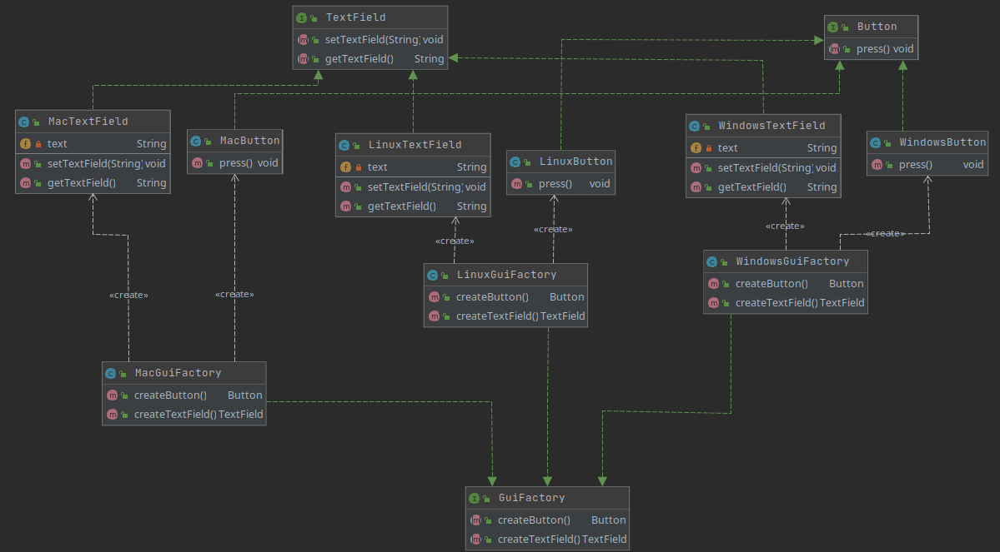

## Description
The abstract factory pattern provides a way to encapsulate a group of individual factories that have a common theme without specifying their concrete classes. In our example, depends on system, specific factory will give us specific buttons and textFields.

## Class diagram
