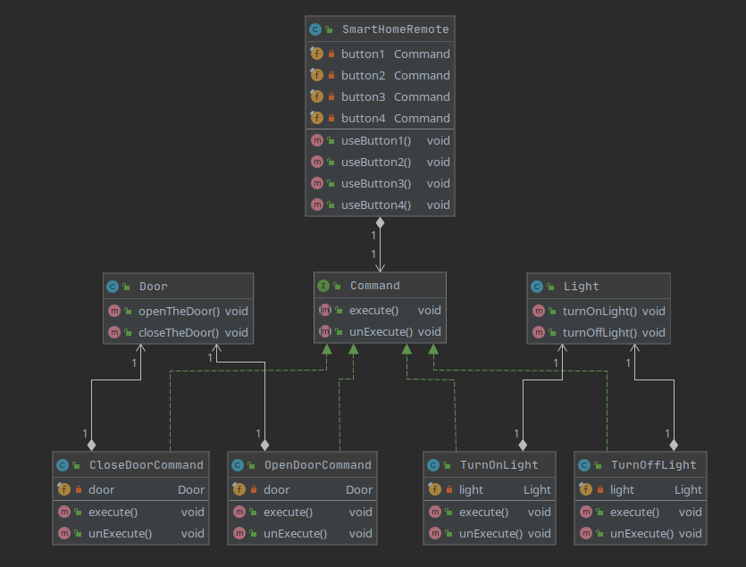

## Description
The command pattern is a behavioral design pattern in which an object is used to encapsulate all information needed to perform an action or trigger an event at a later time.

In our example:
 * the invoker object (knows how to execute a command) is SmartHomeRemote
 * commands (object that knows about receiver and invokes a method of the receiver) are OpenDoorCommand, CloseDoorCommand, TurnOnLightCommand and TurnOffLightCommand
 * receivers (object that does the work when the execute() method in command is called) are instances of Door and Light

## Class diagram
