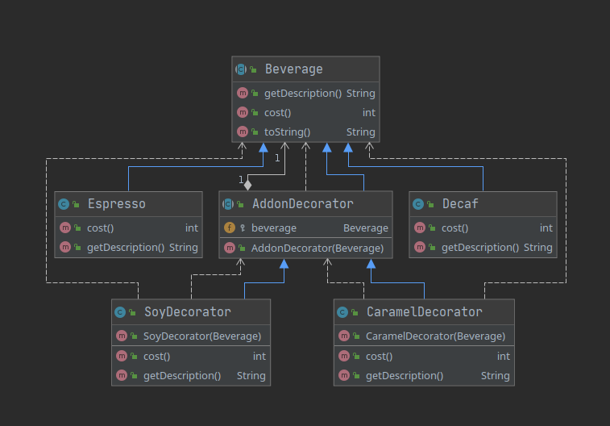

## Description
The decorator pattern is a design pattern that allows behavior to be added to an individual object, dynamically, without affecting the behavior of other objects from the same class.

In our example we can add caramel or soy to our beverage to create a new kind of objects.

## Class diagram

