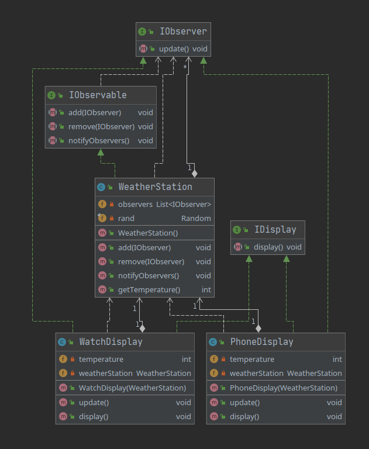

## Description
Observer pattern is design pattern in which an object (in our example WeatherStation), called also subject, maintains a list of dependents, called observers (in our example objects that implements IObserver), notifies them whenever any changes occur.

Also in this implementation I added indicator in IObserver objects to allow calling update function without passing any arguments.

##Class diagram

