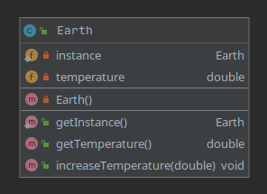

## Description
The singleton pattern is a software design pattern that restricts the instantiation of a class to one "single" instance. This is useful when exactly one object is needed to coordinate actions across the system. 

We can create only one Earth. However, it should not be used. 
One of the reasons is the difficulty of testing and prevents the expansion of a given functionality.
## Class diagram
