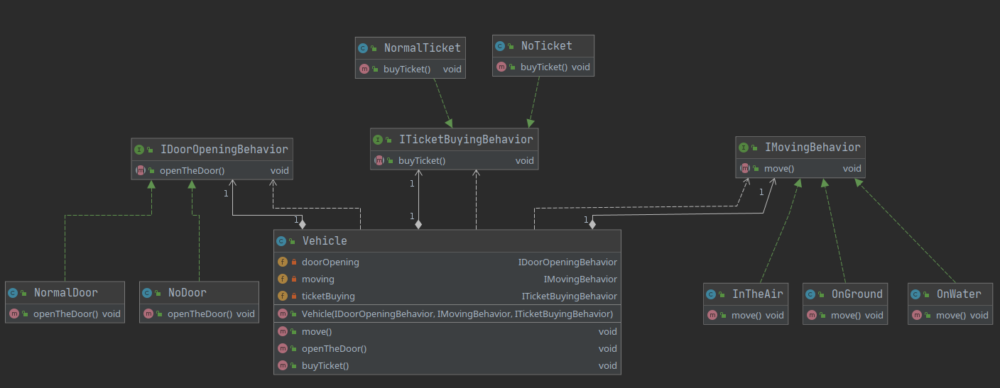

## Description
Strategy pattern is a design pattern that enables selecting an algorithm at runtime. Instead of implementing a single algorithm directly, code receives run-time instructions as to which in a family of algorithms to use.

In the Main class we can create different vehicles just by changing algorithms in the constructor to the specific actions.

## Class diagram
